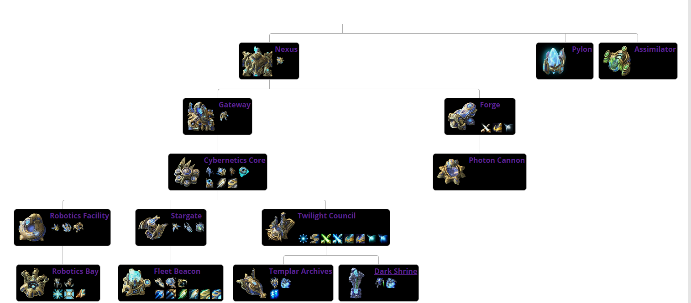

# SC2 ML Bot

A project for building a Starcraft 2 bot using Machine Learning.

## 
- Link to traned model file: [Download here](https://www.dropbox.com/s/q56qc83zjwa2wyc/models.zip?dl=0)

## Overview

If you want to spare some time and just test it out, I've provided a bit of trained data that can be used.
- Link to traned model file: [Download here](https://www.dropbox.com/s/q56qc83zjwa2wyc/models.zip?dl=0)

In general the game at a basic level is actually fairly easy to grasp, though for it to be able to function in a competitive aspect a ton of factors will have to come into play but the baseline follows as such:

- There are resources, minerals and gases, you use these resources to build buildings and units.
- Certain buildings and units are require pre-requisites to exist before they can be constructed.
- There are 3 playable "races", each with their own advantages and disadvantages.
- For this project, **Protoss** is what we're going with, only since it looks cool.
- Building an unit names vary between the races, but relatively similar in concept.
- The building and units order goes as shown:

)
